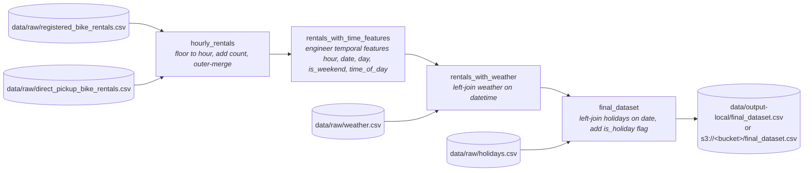

# Project 1 — Bike-Sharing Data Foundations

Preprocessing pipeline for a city-wide bike-sharing company. Takes raw rental, weather, and holiday data and produces a single hourly, ML-ready dataset for downstream demand forecasting.

The work is structured as a [Dagster](https://docs.dagster.io) asset graph so each step has explicit inputs, outputs, and dependencies, can be re-run when new data arrives, and can be monitored through the Dagster UI.

## Data Sources

All raw inputs live in [`data/raw/`](data/raw/):

| File | Grain | Key columns |
| --- | --- | --- |
| `registered_bike_rentals.csv` | one row per booked trip | `datetime`, `user_id`, `location_id` |
| `direct_pickup_bike_rentals.csv` | one row per direct-pickup trip | `datetime`, `user_id`, `location_id` |
| `weather.csv` | one row per hour | `datetime`, `conditions`, `temperature_c`, `perceived_temperature_c`, `humidity`, `windspeed_kmh` |
| `holidays.csv` | one row per holiday | `date`, `holiday` |

## Pipeline



Each asset is a pure pandas transformation. Asset-to-asset handoff is handled by the `CSVIOManager`, which writes every intermediate DataFrame to `<output_dir>/<asset_key>.csv` and reads it back when a downstream asset needs it. The `<output_dir>` is either `data/output-local/` (local backend) or an `s3://<bucket>/` prefix (s3 backend). Raw sources are loaded directly with `pd.read_csv` because they aren't produced by any asset.

### Final schema

`final_dataset.csv` (in [`data/output-local/`](data/output-local/) or in the configured S3 bucket):

| Column | Type | Description |
| --- | --- | --- |
| `datetime` | datetime64 | Hour boundary (floored) |
| `registered_count` | int64 | Booked rentals in that hour |
| `direct_count` | int64 | Direct-pickup rentals in that hour |
| `total_count` | int64 | Sum of the two |
| `hour` | int8 | Hour of day, 0–23 |
| `date` | datetime64 | Calendar date |
| `day` | int8 | Day of week, 0=Mon … 6=Sun |
| `is_weekend` | bool | is Saturday or Sunday? |
| `time_of_day` | int8 | 3=night (0–5), 0=morning (6–11), 1=afternoon (12–17), 2=evening (18–23) |
| `conditions` | str | Weather condition label |
| `temperature_c` | float64 | Temperature (°C) |
| `perceived_temperature_c` | float64 | "Feels like" temperature (°C) |
| `humidity` | float64 | Relative humidity |
| `windspeed_kmh` | float64 | Wind speed (km/h) |
| `is_holiday` | bool | is date in the holiday calendar? |

## Repository Layout

```
Project1/
├── data/
│   ├── raw/                  # source CSVs (inputs)
│   ├── output-local/         # asset outputs when STORAGE_BACKEND=local
│   └── output-s3/            # RustFS container data dir (served as s3://)
├── notebooks/
│   └── processing_clean_data.ipynb   # exploratory counterpart to the pipeline
├── src/
│   └── bike_rental/
│       ├── definitions.py    # wires assets, resources, and IO manager
│       └── defs/
│           ├── assets/               # one file per asset — pure pandas transforms
│           │   ├── hourly.py
│           │   ├── time_features.py
│           │   ├── weather.py
│           │   └── final_dataset.py
│           ├── io_managers/
│           │   └── csv_io_manager.py # reads/writes DataFrames as CSV between assets
│           └── resources/
│               └── config.py         # DataConfig — locations for raw and processed data
├── hour-coverage-issue/
│   └── check_hourly_coverage.py      # standalone script: audits hourly gaps in weather/final data
├── descriptions/             # project brief PDFs
├── start-rustfs.sh           # launches a local RustFS S3-compatible backend
├── pyproject.toml
└── uv.lock
```

### Separation of responsibilities

- **Assets** ([`src/bike_rental/defs/assets/`](src/bike_rental/defs/assets/)) contain the data logic only. They take DataFrames in and return DataFrames out.
- **Resources** ([`src/bike_rental/defs/resources/config.py`](src/bike_rental/defs/resources/config.py)) hold configuration — the raw and processed locations (local path or S3 URI) plus `storage_options` — injected into assets that need them.
- **IO managers** ([`src/bike_rental/defs/io_managers/csv_io_manager.py`](src/bike_rental/defs/io_managers/csv_io_manager.py)) handle persistence. The same manager writes to a local directory or to an S3-compatible bucket depending on the configured `output_dir`.

## Storage Backend

The destination for processed outputs is chosen at startup via the `STORAGE_BACKEND` environment variable (read by [`src/bike_rental/definitions.py`](src/bike_rental/definitions.py)). Raw inputs always come from [`data/raw/`](data/raw/).

| `STORAGE_BACKEND` | Output destination | Notes |
| --- | --- | --- |
| `local` *(default)* | [`data/output-local/`](data/output-local/) | Plain local filesystem writes. |
| `s3` | `s3://<RUSTFS_BUCKET>/` | Writes via `s3fs`; credentials/endpoint from `RUSTFS_*` env vars. |

For the `s3` backend the following environment variables are honored (defaults in parentheses):

- `RUSTFS_BUCKET` (`assets`)
- `RUSTFS_ACCESS_KEY` (`admin`)
- `RUSTFS_SECRET_KEY` (`admin`)
- `RUSTFS_ENDPOINT_URL` (`http://localhost:9000`)

A local RustFS container that serves [`data/output-s3/`](data/output-s3/) as an S3 endpoint on port 9000 can be started with:

```bash
./start-rustfs.sh
```

## Getting Started

### Prerequisites

- Python ≥ 3.12
- [uv](https://docs.astral.sh/uv/) for dependency management
- Docker for Spinning up RustFS container

### Install

```bash
uv sync
```

### Run the pipeline

To materialize against an S3 backend source set `STORAGE_BACKEND=s3` in `.env` file and start RustFS **(FOR LOCAL STORAGE AS A BACKEND SKIP THIS STEP)**: 

```bash
# FOR LOCAL STORAGE AS A BACKEND SKIP THIS STEP
bash start-rustfs.sh
```

Launch the Dagster UI and materialize all assets from there:

```bash
uv run dagster dev -m bike_rental.definitions
```

Open the printed URL, select all four assets, and click **Materialize**. Outputs land in `data/output-local/` (or the configured S3 bucket when `STORAGE_BACKEND=s3`).

To materialize from the command line without the UI:

```bash
uv run dg launch --assets '*' -m bike_rental.definitions
```

## Development

- **Explore interactively:** `uv run jupyter lab notebooks/processing_clean_data.ipynb`
- **Lint / format:** `uv run ruff check .` and `uv run ruff format .`
- **Docstrings:** NumPy-style on all non-trivial functions.
- **Check hourly coverage:** `uv run python hour-coverage-issue/check_hourly_coverage.py` audits `weather.csv` and `final_dataset.csv` for missing or duplicate hours across 2011–2012.