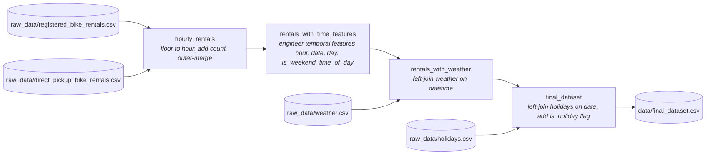

# Project 1 — Bike-Sharing Data Foundations

Preprocessing pipeline for a city-wide bike-sharing company. Takes raw rental, weather, and holiday data and produces a single hourly, ML-ready dataset for downstream demand forecasting.

The work is structured as a [Dagster](https://docs.dagster.io) asset graph so each step has explicit inputs, outputs, and dependencies, can be re-run when new data arrives, and can be monitored through the Dagster UI.

## Data Sources

All raw inputs live in [`raw_data/`](raw_data/):

| File | Grain | Key columns |
| --- | --- | --- |
| `registered_bike_rentals.csv` | one row per booked trip | `datetime`, `user_id`, `location_id` |
| `direct_pickup_bike_rentals.csv` | one row per direct-pickup trip | `datetime`, `user_id`, `location_id` |
| `weather.csv` | one row per hour | `datetime`, `conditions`, `temperature_c`, `perceived_temperature_c`, `humidity`, `windspeed_kmh` |
| `holidays.csv` | one row per holiday | `date`, `holiday` |

## Pipeline



Each asset is a pure pandas transformation. Asset-to-asset handoff is handled by the `CSVIOManager`, which writes every intermediate DataFrame to `data/<asset_key>.csv` and reads it back when a downstream asset needs it. Raw sources are loaded directly with `pd.read_csv` because they aren't produced by any asset.

### Final schema

[`data/final_dataset.csv`](data/final_dataset.csv):

| Column | Type | Description |
| --- | --- | --- |
| `datetime` | datetime64 | Hour boundary (floored) |
| `registered_count` | int64 | Booked rentals in that hour |
| `direct_count` | int64 | Direct-pickup rentals in that hour |
| `total_count` | int64 | Sum of the two |
| `hour` | int8 | Hour of day, 0–23 |
| `date` | datetime64 | Calendar date |
| `day` | int8 | Day of week, 0=Mon … 6=Sun |
| `is_weekend` | bool | is Saturday or Sunday? |
| `time_of_day` | int8 | 3=night (0–5), 0=morning (6–11), 1=afternoon (12–17), 2=evening (18–23) |
| `conditions` | str | Weather condition label |
| `temperature_c` | float64 | Temperature (°C) |
| `perceived_temperature_c` | float64 | "Feels like" temperature (°C) |
| `humidity` | float64 | Relative humidity |
| `windspeed_kmh` | float64 | Wind speed (km/h) |
| `is_holiday` | bool | is date in the holiday calendar? |

## Repository Layout

```
Project1/
├── raw_data/                 # source CSVs (inputs)
├── data/                     # asset outputs written by CSVIOManager
├── notebooks/
│   └── processing_clean_data.ipynb   # exploratory counterpart to the pipeline
├── pipeline/
│   ├── assets/               # one file per asset — pure pandas transforms
│   │   ├── hourly.py
│   │   ├── time_features.py
│   │   ├── weather.py
│   │   └── final_dataset.py
│   ├── io_managers/
│   │   └── csv_io_manager.py # reads/writes DataFrames as CSV between assets
│   ├── resources/
│   │   └── config.py         # DataConfig — paths to raw and processed data dirs
│   └── definitions.py        # wires assets, resources, and IO manager
├── descriptions/             # project brief PDFs
├── pyproject.toml
└── uv.lock
```

### Separation of responsibilities

- **Assets** ([`pipeline/assets/`](pipeline/assets/)) contain the data logic only. They take DataFrames in and return DataFrames out.
- **Resources** ([`pipeline/resources/config.py`](pipeline/resources/config.py)) hold configuration — the raw and processed directory paths — injected into assets that need them.
- **IO managers** ([`pipeline/io_managers/csv_io_manager.py`](pipeline/io_managers/csv_io_manager.py)) handle persistence. Swapping CSV for Parquet or object storage would not require touching any asset.

## Getting Started

### Prerequisites

- Python ≥ 3.12
- [uv](https://docs.astral.sh/uv/) for dependency management

### Install

```bash
uv sync
```

### Run the pipeline

Launch the Dagster UI and materialize all assets from there:

```bash
uv run dagster dev -m pipeline.definitions
```

Open the printed URL, select all four assets, and click **Materialize**. Outputs land in `data/`.

To materialize from the command line without the UI:

```bash
uv run dg launch --assets '*' -m pipeline.definitions
```

## Development

- **Explore interactively:** `uv run jupyter lab notebooks/processing_clean_data.ipynb`
- **Lint / format:** `uv run ruff check .` and `uv run ruff format .`
- **Docstrings:** NumPy-style on all non-trivial functions.