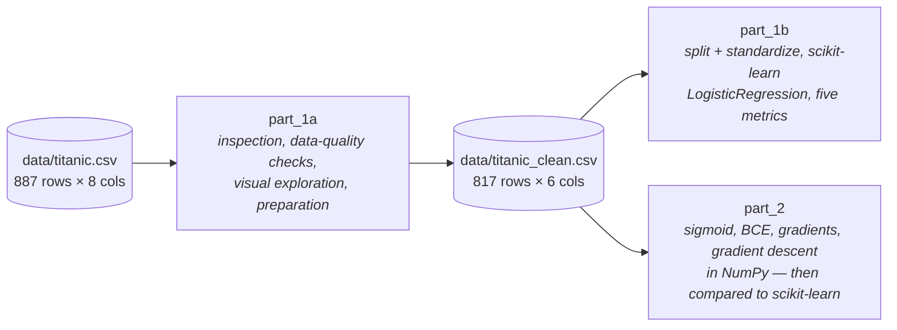

# Project 2A-1 — Titanic Survival Classification

Supervised-learning foundations on the Titanic passenger dataset: predict whether a
passenger survived from their age, sex, ticket class, and family size.

The work is split into two parts, mirroring the project brief in
[description/](description/):

- **Part 1** — explore and prepare the dataset, then train and evaluate a
  logistic-regression classifier with [scikit-learn](https://scikit-learn.org).
- **Part 2** — re-implement the same model from scratch with NumPy only
  (sigmoid, binary cross-entropy, gradients, gradient-descent loop) and verify
  it against scikit-learn's result.

Everything lives in Jupyter notebooks; there is no package to install or
pipeline to run.

## Notebooks

Run them in this order — Part 1a writes the cleaned CSV that the other two read.



| Notebook | Contents |
| --- | --- |
| [notebooks/titanic_survival_part_1a.ipynb](notebooks/titanic_survival_part_1a.ipynb) | Loading & inspection, data-quality checks, visual exploration, preparation → writes `data/titanic_clean.csv` |
| [notebooks/titanic_survival_part_1b.ipynb](notebooks/titanic_survival_part_1b.ipynb) | Train/test split, standardization, `LogisticRegression` fit, evaluation across five metrics + confusion matrix and ROC curve |
| [notebooks/titanic_survival_part_2.ipynb](notebooks/titanic_survival_part_2.ipynb) | The math written out, each model component as its own NumPy function, training loop with loss tracking, from-scratch metrics, side-by-side comparison with scikit-learn |

[templates/](templates/) holds the unmodified starter notebook for Part 2 that was
handed out with the brief, kept for reference.

## Data

### Raw — [data/titanic.csv](data/titanic.csv)

887 rows, already numerically encoded (no strings, no missing values):

| Column | Type | Description |
| --- | --- | --- |
| `sex` | int64 | 0 = female, 1 = male |
| `age` | float64 | Age in years; fractional values encode months (`0.42` = 5 months) |
| `family_size` | int64 | Number of relatives aboard |
| `fare` | float64 | Ticket fare |
| `1st_class` / `2nd_class` / `3rd_class` | int64 | One-hot encoding of the ticket class |
| `survived` | int64 | Target — 1 = survived |

### Cleaned — [data/titanic_clean.csv](data/titanic_clean.csv)

817 rows × 6 columns, produced by Part 1a and consumed by Parts 1b and 2:
`sex`, `age`, `1st_class`, `2nd_class`, `family_size_lt4`, `survived`.

## What the exploration found

- **No missing values**, but **70 duplicate rows (~8%)** — keeping them would give
  some passengers extra weight during training.
- **`age` has 17 fractional values** (the infant month encoding).
- **The three class columns are a clean one-hot encoding** — every row sums to 1,
  which makes the third column linearly dependent on the other two.
- **`sex` is by far the strongest predictor**; ticket class comes second
  (1st class survived ~63%, 3rd class ~24%).
- **`fare` correlates with survival but also strongly with `1st_class`**, so its
  independent signal is limited.
- The target is mildly imbalanced (~39% survived) — enough that accuracy alone
  would be misleading.

## Preparation decisions

Each transformation in Part 1a follows from a finding above:

| Step | Reason |
| --- | --- |
| Drop duplicate rows | No passenger should be counted twice |
| Floor `age` to integer years | Fixes the fractional infant encoding; more interpretable |
| Replace `family_size` with binary `family_size_lt4` | The raw column is heavily right-skewed; a split at 4 captures the "small family" effect without letting the long tail dominate a linear model |
| Drop `3rd_class` | Reference category — removes the perfect collinearity of the one-hot encoding |
| Drop `fare` | Its signal is largely already in the class columns; keeps the feature set small and interpretable |

Splitting and scaling deliberately happen *after* this, in the modeling
notebooks: the split is stratified on the target and `StandardScaler` is fit on
the training set only, so no test-set statistics leak into training.

## Results

Both implementations are trained on the same features and the same stratified
80/20 split (`random_state=42`), giving 653 training and 164 test rows.

Test-set metrics:

| Metric | scikit-learn | From scratch |
| --- | --- | --- |
| Accuracy | 0.854 | 0.854 |
| Precision | 0.904 | 0.904 |
| Recall | 0.712 | 0.712 |
| F1 | 0.797 | 0.797 |
| ROC AUC | 0.878 | 0.878 |

Confusion counts (164 test rows): TP = 47, FP = 5, TN = 93, FN = 19.

Learned coefficients on standardized features — the two solvers agree to within
~0.01:

| Feature | scikit-learn | From scratch |
| --- | --- | --- |
| `sex` | −1.230 | −1.236 |
| `age` | −0.608 | −0.597 |
| `1st_class` | +0.965 | +0.956 |
| `2nd_class` | +0.470 | +0.465 |
| `family_size_lt4` | +0.519 | +0.520 |
| bias | −0.534 | −0.529 |

The signs match the exploration: being male (`sex=1`) and older lowers the
predicted survival probability, while a higher ticket class — relative to the
dropped 3rd-class reference — and a small family raise it.

Reading the metrics together: accuracy is partly inflated by the majority class
(always predicting "died" already scores ~60%), and precision well above recall
shows the model is conservative — when it predicts survival it is usually right,
but most of its errors are survivors classified as dead. ROC AUC of 0.878 is
computed from the probabilities, so it is the most threshold-agnostic view: the
model ranks survivors above non-survivors far better than chance.

The from-scratch gradient descent (`lr=0.1`, zero-initialized parameters) stops
after 500 iterations on the loss-change tolerance, with training loss falling
monotonically from 0.693 to 0.455. The residual ROC-AUC gap of 0.0006 against
scikit-learn is simply gradient descent converging slightly less tightly than
L-BFGS.

## Setup

Dependencies are managed with [uv](https://docs.astral.sh/uv/) and the project
targets Python 3.12+:

```bash
uv sync
```

This installs pandas, NumPy, scikit-learn, and matplotlib plus the dev group
(Jupyter, ruff).

## Running

Start JupyterLab and work through the notebooks in order:

```bash
uv run jupyter lab
```

The notebooks resolve data paths relative to `notebooks/` (`../data/…`), so run
them from their own directory — as JupyterLab does by default.

To execute the whole set headlessly instead:

```bash
uv run jupyter execute notebooks/titanic_survival_part_1a.ipynb \
                       notebooks/titanic_survival_part_1b.ipynb \
                       notebooks/titanic_survival_part_2.ipynb
```

## Layout

```
Project2A-1/
├── data/
│   ├── titanic.csv           # raw dataset (input)
│   └── titanic_clean.csv     # output of Part 1a, input to Parts 1b and 2
├── notebooks/
│   ├── titanic_survival_part_1a.ipynb   # exploration & preparation
│   ├── titanic_survival_part_1b.ipynb   # scikit-learn model & evaluation
│   └── titanic_survival_part_2.ipynb    # logistic regression from scratch
├── templates/                # starter notebook handed out with the brief
├── description/              # project brief (PDF)
├── pyproject.toml
└── uv.lock
```
