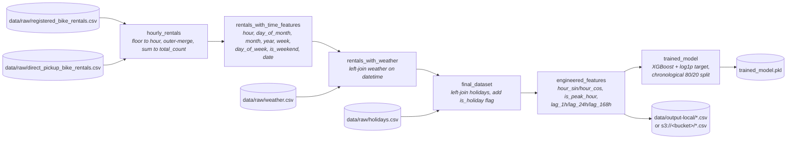

# Bike Rental Demand Prediction

A Dagster-based pipeline that predicts hourly bike rental demand from
historical trip records, weather data, and holiday calendars. The end-to-end
flow — from raw CSVs to a trained XGBoost model — is materialized as a graph
of Dagster assets and can write its outputs either to local disk or to an
S3-compatible object store (RustFS / MinIO / AWS S3).

## What the pipeline does

The asset graph is defined in [src/bike_rental/definitions.py](src/bike_rental/definitions.py)
and runs in this order:




1. **[`hourly_rentals`](src/bike_rental/defs/assets/hourly.py)** — loads
   `registered_bike_rentals.csv` and `direct_pickup_bike_rentals.csv`,
   floors each trip to the hour, outer-merges the two sources, and sums
   them into a single `total_count` per hour.
2. **[`rentals_with_time_features`](src/bike_rental/defs/assets/time_features.py)**
   — derives `hour`, `day_of_month`, `month`, `year`, `week`, `day_of_week`,
   `is_weekend`, and a `date` join key from the timestamp.
3. **[`rentals_with_weather`](src/bike_rental/defs/assets/weather.py)** —
   left-joins `weather.csv` (conditions, temperature, perceived temperature,
   humidity, windspeed).
4. **[`final_dataset`](src/bike_rental/defs/assets/final_dataset.py)** —
   left-joins `holidays.csv` and converts it to a boolean `is_holiday` flag.
5. **[`engineered_features`](src/bike_rental/defs/assets/features.py)** —
   adds cyclic encodings (`hour_sin`, `hour_cos`), an `is_peak_hour`
   interaction flag, and lag features (`lag_1h`, `lag_24h`, `lag_168h`).
   The first 168 rows containing lag NaNs are dropped.
6. **[`trained_model`](src/bike_rental/defs/assets/model.py)** — trains a
   `TransformedTargetRegressor` wrapping XGBoost with a `log1p` / `expm1`
   target transform on a chronological 80/20 split. Test RMSE ≈ 45.5,
   MAE ≈ 28.6, R² ≈ 0.957 (matches notebook 03).

## Project layout

```
.
├── data/
│   ├── raw/               # input CSVs (rentals, weather, holidays)
│   ├── output-local/      # local pipeline outputs
│   └── output-s3/         # bind mount of RUSTFS's /data dir
├── notebooks/             # exploration and modelling notebooks
│   ├── 00_processing_clean_data.ipynb
│   ├── 01_eda.ipynb
│   ├── 02_baseline_linear_regression.ipynb
│   └── 03_model_improvement.ipynb
├── src/bike_rental/
│   ├── definitions.py     # Dagster Definitions entry point
│   └── defs/
│       ├── assets/        # one file per asset in the pipeline
│       ├── io_managers/   # CSV + pickle IO managers (local / S3)
│       └── resources/     # DataConfig resource
├── logs/                  # bind mount of RUSTFS's /logs dir
├── start-rustfs.sh        # spins up a local RustFS via Docker
└── pyproject.toml
```

## Setup

The project uses [`uv`](https://docs.astral.sh/uv/) for dependency
management and targets Python 3.10 – 3.14.

```bash
uv sync
```

This installs runtime dependencies (Dagster, pandas, scikit-learn,
XGBoost, s3fs) plus the dev group (`dagster-webserver`, `dagster-dg-cli`,
Jupyter, ruff).

## Running the pipeline

### Local storage (default)

Outputs land in `data/output-local/`:

```bash
uv run dg launch --assets '*'
```

To open the Dagster UI:

```bash
uv run dg dev
```

### S3 / RustFS storage

Set `STORAGE_BACKEND=s3` and the `RUSTFS_*` variables (see `.env` below),
then launch the same way. CSV assets are written to
`s3://<RUSTFS_BUCKET>/<asset_key>.csv`; the pickled model goes to
`s3://<RUSTFS_BUCKET>/trained_model.pkl`.

To start a local RustFS container backed by Docker:

```bash
./start-rustfs.sh
```

The script reads its ports, credentials, and storage paths from `.env`
and exposes the API at `http://localhost:9000` and the web UI at
`http://localhost:9001`.

## Configuration

Environment variables (loaded from `.env` at the repo root via
`python-dotenv`):

| Variable               | Default              | Purpose                                     |
| ---------------------- | -------------------- | ------------------------------------------- |
| `STORAGE_BACKEND`      | `local`              | `local` or `s3`                             |
| `RAW_DATA_DIR`         | `data/raw`           | Where raw CSVs are read from                |
| `LOCAL_STORAGE_DIR`    | `data/output-local`  | Local output directory                      |
| `RUSTFS_BUCKET`        | `assets`             | Destination bucket for S3 backend           |
| `RUSTFS_ENDPOINT_URL`  | `http://localhost:9000` | S3 endpoint                              |
| `RUSTFS_ACCESS_KEY`    | `admin`              | S3 access key                               |
| `RUSTFS_SECRET_KEY`    | `admin`              | S3 secret key                               |
| `RUSTFS_STORAGE_DIR`   | `data/output-s3`     | Host dir bind-mounted into RustFS container |
| `RUSTFS_LOGS_DIR`      | `logs`               | Host dir for RustFS container logs          |
| `ENDPOINT_PORT`        | `9000`               | RustFS S3 API port                          |
| `WEB_SERVER_UI_PORT`   | `9001`               | RustFS web console port                     |

The `DataConfig` resource ([src/bike_rental/defs/resources/config.py](src/bike_rental/defs/resources/config.py))
hides the local-vs-S3 distinction behind a single string location (path or
`s3://` URI), so asset code is identical across backends.

## Notebooks

The `notebooks/` directory captures the analytical work the pipeline was
built around — clean up, EDA, a linear-regression baseline, and the model
improvement work that motivated the final XGBoost + `log1p` configuration.
The asset code in `defs/assets/` mirrors the decisions made there.

## Development

```bash
uv run ruff check .            # lint (numpy-style docstrings, line length 80)
uv run ruff format .           # format
uv run dg check defs           # validate the Dagster definitions
```
