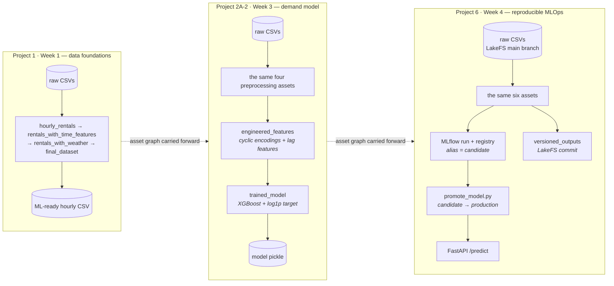

# ML & MLOps

Repository for the ML/MLOps projects. Each numbered directory is a
self-contained project with its own brief, dependencies, and README — from raw-data
preprocessing through model training to a versioned, served, self-retraining
pipeline.

Three of the four projects build on the same **bike-sharing demand** problem and
grow it step by step into a production-shaped system; the fourth is a standalone
detour into modeling fundamentals.

## Projects

| Directory | Brief | What it is | Stack |
| --- | --- | --- | --- |
| [Project1/](Project1/) | Week 1 — Data foundations | Preprocessing pipeline: raw rental, weather, and holiday CSVs → one hourly ML-ready dataset | Dagster, pandas, RustFS/S3 |
| [Project2A-1/](Project2A-1/) | Week 2 — Modeling foundations | Titanic survival classification: logistic regression with scikit-learn, then re-implemented from scratch in NumPy | Jupyter, pandas, scikit-learn, NumPy |
| [Project2A-2/](Project2A-2/) | Week 3 — Bike rental predictions | Extends Project 1's graph with feature engineering and a trained XGBoost demand model | Dagster, scikit-learn, XGBoost |
| [Project6/](Project6/) | Week 4 — Reproducible pipelines | Wraps the pipeline in the operational layer: experiment tracking, a model registry, data versioning, and a prediction API | Dagster, MLflow, LakeFS, FastAPI |

Directory numbers are internal labels and do not line up with the week numbers —
the table above is the authoritative mapping.

## How the projects relate



[Project 2A-1](Project2A-1/) sits outside this chain: a standalone pair of notebook
tracks on the Titanic dataset, training logistic regression first with a library and
then from scratch.

Each project restates the previous graph rather than importing it, so every
directory can be cloned, installed, and run on its own.

The progression in one line each:

1. **Project 1** — get the data right: four pandas assets, explicit dependencies, a
   swappable local/S3 output backend.
2. **Project 2A-1** — understand the model: what `LogisticRegression().fit()`
   actually does, verified by rebuilding it with NumPy.
3. **Project 2A-2** — train a real model in the pipeline: cyclic encodings, lag
   features, XGBoost on a chronological split (test RMSE ≈ 45.5, R² ≈ 0.96).
4. **Project 6** — make it reproducible and serve it: MLflow tracking + registry,
   LakeFS data versioning, alias-based promotion, a FastAPI endpoint, and a sensor
   that retrains when the source data changes.

## Shared conventions

The three pipeline projects (1, 2A-2, 6) are deliberately consistent:

- **Dependency management** — [uv](https://docs.astral.sh/uv/), one lockfile per
  project. Every project pins Python 3.12 via `.python-version`.
- **Structure** — a `bike_rental` package with `definitions.py` wiring the Dagster
  `Definitions`, and `defs/` split into `assets/` (pure pandas/sklearn transforms),
  `io_managers/` (persistence), and `resources/` (configuration).
- **Storage backends** — chosen at startup with the `STORAGE_BACKEND` environment
  variable, so asset code is identical whether outputs go to a local directory, an
  S3-compatible bucket, or (Project 6) LakeFS.
- **Local infrastructure** — `start-*.sh` scripts bring up the Docker services each
  project needs (RustFS, LakeFS, MLflow, the API).
- **Linting** — identical ruff config: line length 80, rules `E, W, F, I, UP, D`,
  NumPy-style docstrings.

Project 2A-1 is notebooks only — no package, no Dagster, no services.

## Getting started

Everything is per-project; there is no root-level environment. Prerequisites are
[uv](https://docs.astral.sh/uv/) and, for the pipeline projects' non-local storage
backends, Docker.

```bash
cd Project1        # or Project2A-1 / Project2A-2 / Project6
uv sync
```

Then follow that project's README:

- [Project1/README.md](Project1/README.md)
- [Project2A-1/README.md](Project2A-1/README.md)
- [Project2A-2/README.md](Project2A-2/README.md)
- [Project6/README.md](Project6/README.md)

Project 6 is the most complete of the four and the best starting point if you only
read one.

## Layout

```
.
├── Project1/       # Week 1 — Dagster preprocessing pipeline
├── Project2A-1/    # Week 2 — Titanic classification notebooks
├── Project2A-2/    # Week 3 — bike-rental demand model in the pipeline
├── Project6/       # Week 4 — MLflow + LakeFS + FastAPI MLOps pipeline
└── .gitignore
```

Each project directory carries its own `data/`, `pyproject.toml`, `uv.lock`,
`README.md`, and the project brief PDF it was built from.
